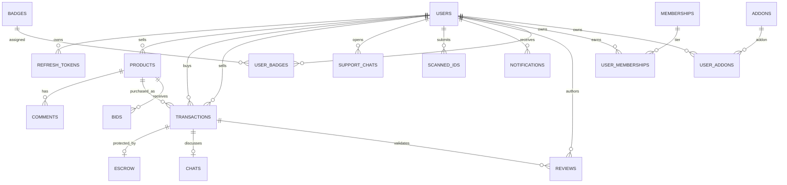

# Getsocs MySQL Data Layer

## Overview

Production persistence now targets **MySQL 8+ / InnoDB**. `server/db.json` is no longer a production database. JSON remains supported only as an explicit test fixture (`NODE_ENV=test` + `TEST_DB_FILE`) and as a source format for the one-time migration utility.

The current repository APIs still expose some state-oriented operations to preserve application behavior. The MySQL adapter stores every application collection in a dedicated relational table, with indexed relational columns for important query/join fields and a `payload JSON` column that preserves the complete legacy object while domain repositories are narrowed incrementally.

## Schema / relationship chart



## Tables

`app_meta`, `users`, `refresh_tokens`, `products`, `comments`, `transactions`, `chats`, `support_chats`, `scanned_ids`, `bids`, `escrow`, `notifications`, `idempotency_keys`, `reviews`, `badges`, `user_badges`, `ad_spaces`, `banned_ips`, `email_delete_blocks`, `memberships`, `user_memberships`, `addons`, `user_addons`, and `analytics`.

Important indexes include refresh-token hash/family/user/expiry, user email/username, product seller/status/platform, transaction buyer/seller/status/product, bid listing/bidder/status, escrow status/end time, unread notifications by user, active memberships/add-ons by user, and idempotency expiration/scope.

## Bootstrap a new database

1. Edit `server/.env` and set `DB_DRIVER=mysql`, `DB_HOST`, `DB_PORT`, `DB_NAME`, `DB_USER`, and `DB_PASS`.
2. Install server dependencies.
3. Run:

```bash
cd server
npm run db:bootstrap
npm run db:verify
```

`db:bootstrap` creates the database/tables and seeds the default membership/add-on definitions. It is safe to run repeatedly because the schema uses `IF NOT EXISTS` and the seed uses upsert semantics.

With Docker, `docker compose up -d --build` starts MySQL 8.4, initializes the schema/seed on the first volume creation, waits for MySQL health, and then starts the application.

## Migrate an existing db.json

Take a copy of the JSON database before migration, bootstrap MySQL, then run:

```bash
cd server
npm run db:migrate:json -- --source=/absolute/path/to/db.json
```

The migration:

- validates/backfills the legacy collection shape;
- refuses to overwrite a non-empty target by default;
- writes all collections in one InnoDB transaction;
- preserves complete legacy records in JSON payloads;
- populates relational/index columns;
- re-reads MySQL and compares record counts collection-by-collection.

Only after reviewing a backup should `--force` be used against a non-empty target.

## Backup / rollback export

```bash
cd server
npm run db:export -- --out=/secure/path/getsocs-backup.json
```

This creates a restricted-permission JSON export that can be retained as an emergency migration snapshot. It is not used by production requests.

## Concurrency model

Every state write executes in an InnoDB transaction. `app_meta.state_version` provides optimistic concurrency protection: a stale state snapshot is rejected instead of silently overwriting a newer update. `withDbLock()` uses `SELECT ... FOR UPDATE` on that version row for multi-step operations that require a serialized read-modify-write transaction.

This compatibility layer favors correctness and migration safety over query efficiency. The next optimization is to replace state-oriented domain repository calls with targeted SQL queries/updates one domain at a time; the schema already exposes the indexed columns needed for that work.
